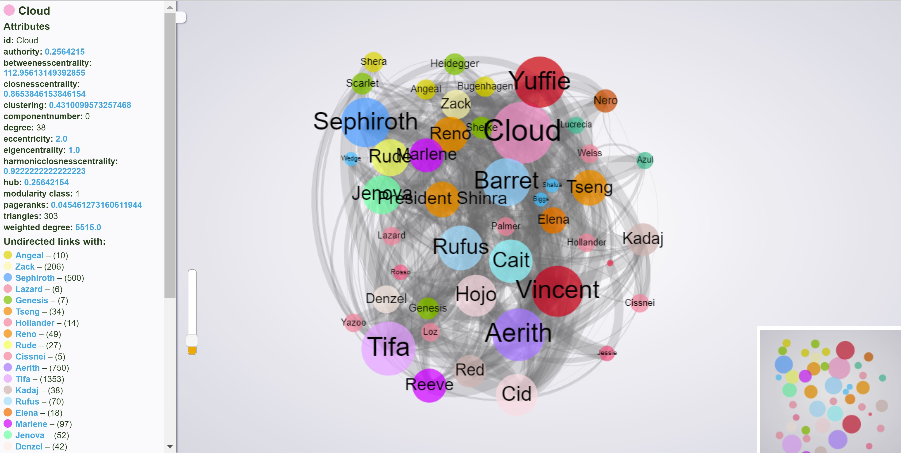

# final-fantasy-network

I love Final Fantasy 7 with a deep and burning passion. For my own amusement, I decided to graph all of the interactions between all of the characters in the Compilation of Final Fantasy 7 (including the original, Advent Children, Dirge of Cerberus, and Crisis Core) to see if any interesting trends emerged. Personally, I think I proved that CloTi is objectively a better ship than Clerith, but I'll let the data speak for itself. 

Web demo: https://ndevasia.github.io/final-fantasy-network/index.html

Data parsing method inspired by algorithm described in [Graph of Thrones](https://www.lyonwj.com/2016/06/26/graph-of-thrones-neo4j-social-network-analysis/). Credit for JS script for .gexf file goes to raphv/gexf.js [here](https://github.com/raphv/gexf-js). 

If I ever come back to improve this, I would definitely try to not harcode the names and use a more up to date graphing software because the Gephi UI wasn't nice to work with, and also was like a million years old. 

## Instructions to view graph locally:
- Clone repository
- cd into repository
- Start up local server with command `python -m http.server 1234`
- Open up http://localhost:1234/ in browser
